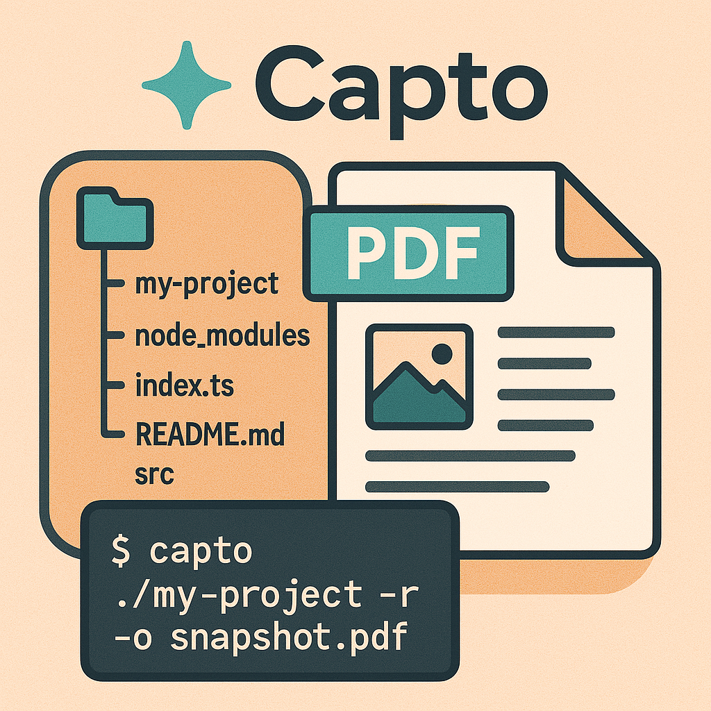

> A stylish tool for generating directory snapshots as PDFs.

Capto captures the structure of directories and the content of files into a beautiful PDF document. It displays not only text files but also image files, respects `.gitignore` rules, and automatically detects binary files. The output is in a format optimized for multi-modal LLM consumption.

## 📦 Installation

Install globally using npm:

```bash
npm install -g capto
```

Alternatively, use it temporarily without installation:

```bash
npx capto <directory>
```

## 🚀 Usage

### Basic Usage

Process only the top-level files:

```bash
capto ./my-project -o snapshot.pdf
```

Recursively process including subdirectories:

```bash
capto ./my-project -r -o snapshot.pdf
```

### Other Examples

Specify additional ignore patterns:

```bash
capto ./my-project -i '*.log' '*.tmp' -o snapshot.pdf
```

Specify font size and title:

```bash
capto ./my-project -f 12 -t "Project Snapshot" -o snapshot.pdf
```

## 🎯 Features

- Elegant directory tree display
- Displays text file content with line numbers
- Directly shows image files within the PDF
- Recursive or non-recursive scan mode
- Automatic application of `.gitignore` rules
- Automatic detection of binary files
- Supports various text encodings
- Optimized for analysis by multi-modal LLMs
- Customizable PDF design

## 🛠️ Command Line Options

```bash
Usage: capto <directory> [options]

Arguments:
  directory              Target directory

Options:
  -o, --output <file>    Output PDF file name (default: "snapshot.pdf")
  -i, --ignore <patterns...>  Additional ignore patterns
  -f, --fontsize <size>  Font size (default: "10")
  -t, --title <title>    PDF title (default: "Directory Snapshot")
  -r, --recursive        Process subdirectories recursively
  -V, --version          Display version information
  -h, --help             Display help
```

## ⚙️ Development Setup

### Local Setup

Clone the repository and install dependencies:

```bash
git clone https://github.com/yourusername/capto.git
cd capto
npm install
npm run build
npm link
```

### Run Locally

```bash
npm start -- <directory> [options]
```

## 📄 License

MIT License
